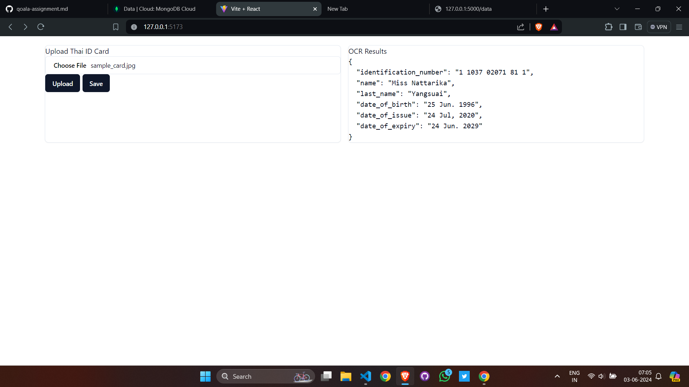
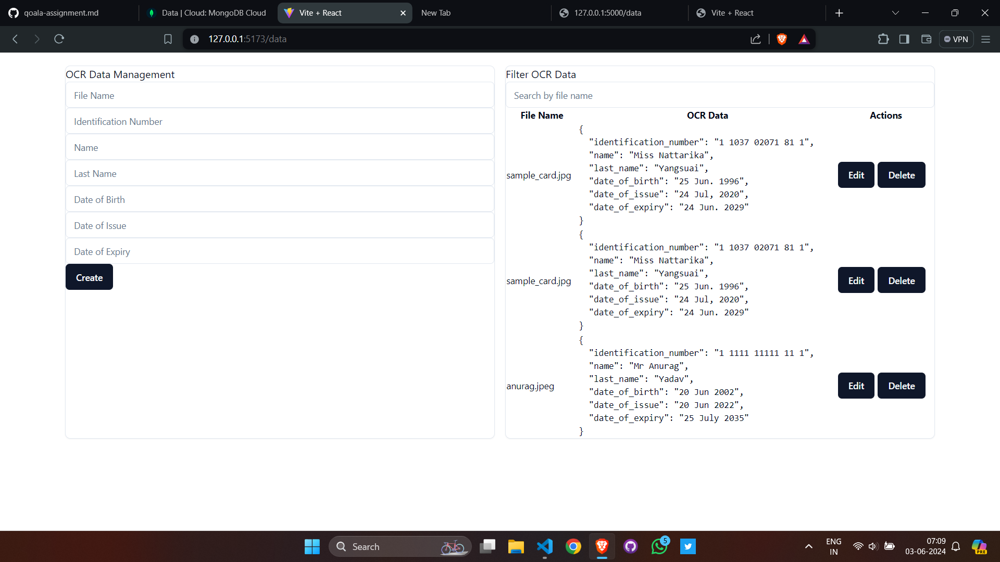

# OCR-APP

# Application Architecture

## Overview

This application is built using Flask for the backend and React for the frontend. It integrates with MongoDB for data storage and uses Google Cloud Vision API for OCR (Optical Character Recognition). The application allows users to upload images of Thai ID cards, extract relevant information using OCR, and manage the extracted data through a CRUD interface.

Application Demo Video - https://www.loom.com/share/551da3436b124ec89b23b49790ff8396?sid=295e08f9-5361-448d-b05f-573571881f5e

Code Explanation Video- https://www.loom.com/share/f0501da8a36848ef9ff52107da7ab9d3?sid=70ce2476-b4d5-4993-9d29-5a8b534a102e

## Technologies Used

- **Backend**: Flask
- **Frontend**: React
- **Database**: MongoDB
- **OCR**: Google Cloud Vision API
- **Styling**: Tailwind CSS (or Bootstrap, if preferred)
- **State Management**: React Hook Form

## Backend

### Flask Application

The Flask application handles the following tasks:

1. **OCR Processing**:
   - Uses Google Cloud Vision API to detect text in uploaded images.
   - Extracts relevant information using regular expressions.

2. **CRUD Operations**:
   - Provides endpoints to create, read, update, and delete OCR data in MongoDB.

3. **CORS**:
   - Enabled using `flask-cors` to allow cross-origin requests from the React frontend.

Using this application you can Scan Thai ID cards using Google Cloud Vision API and get following information 

<ul>
<li>Identification Number
<li>Name
<li>Last Name
<li>Date of Birth
<li>Date of Issue
<li>Date of Expiry
</ul>

To use this application, you will need following things

<ul>
<li>Cloud Vision Credentials to use the API
</ul>

Here are the steps in which you can access the application after you have successfully added your credentials path in main.py

<ul>
<li> cd into the server folder and run - python main.py into the terminal which will start your development server
<li> cd into the source folder and run - npm run dev into the terminal which will start your React client
</ul>

On the main page, click on no file chosen and select the image, after the image is selected click on Upload. You will see the results on the right panel like this

Click on Save Button to save the details into the database.(MongoDB)

After Saving navigate to /data endpoint which is the <strong>OCR Management Console</strong>, where you can Create,Update,Delete and Read all the OCR Results available in the Database. 

